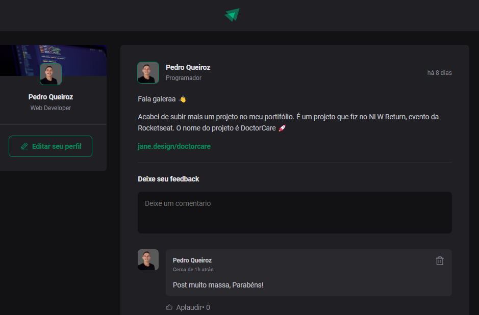

<h1 align="center">Comment-React</h1>

Esta aplicação foi desenvilvida com a finalidade de praticar sobre os fundamentos do React js.
 

  <a href="#-tecnologias">Tecnologias</a>&nbsp;&nbsp;&nbsp;|&nbsp;&nbsp;&nbsp;
  <a href="#-projeto">Projeto</a>&nbsp;&nbsp;&nbsp;|&nbsp;&nbsp;&nbsp;
  <a href="#-layout">Layout</a>&nbsp;&nbsp;&nbsp;|&nbsp;&nbsp;&nbsp;
  <a href="#memo-licença">Licença</a>

  

 

  

## 🚀 Tecnologias

Esse projeto foi desenvolvido com as seguintes tecnologias:

<strong>FRONTEND</strong>

- React - Vite
- JavaScript
- Date Fns - Formatação das datas

## 💻 Projeto
É uma aplicação simples que consiste na criação de Posts e em cada post é possivel inserir/excluir um comentario e reagir ao post.
Com a construção da aplicação foi possivel aprender de fato os fundamentos do react. Dentre eles: 

- Componentes
- Estados
- Propriedades
- Conceito de Iteração
- Imutabilidade
- Generics 

## 🔖 Layout

Você pode visualizar o layout do projeto através [DESSE LINK](. É necessário ter conta no [Figma](https://figma.com) para acessá-lo.

## :memo: Licença

Esse projeto está sob a licença MIT.

---